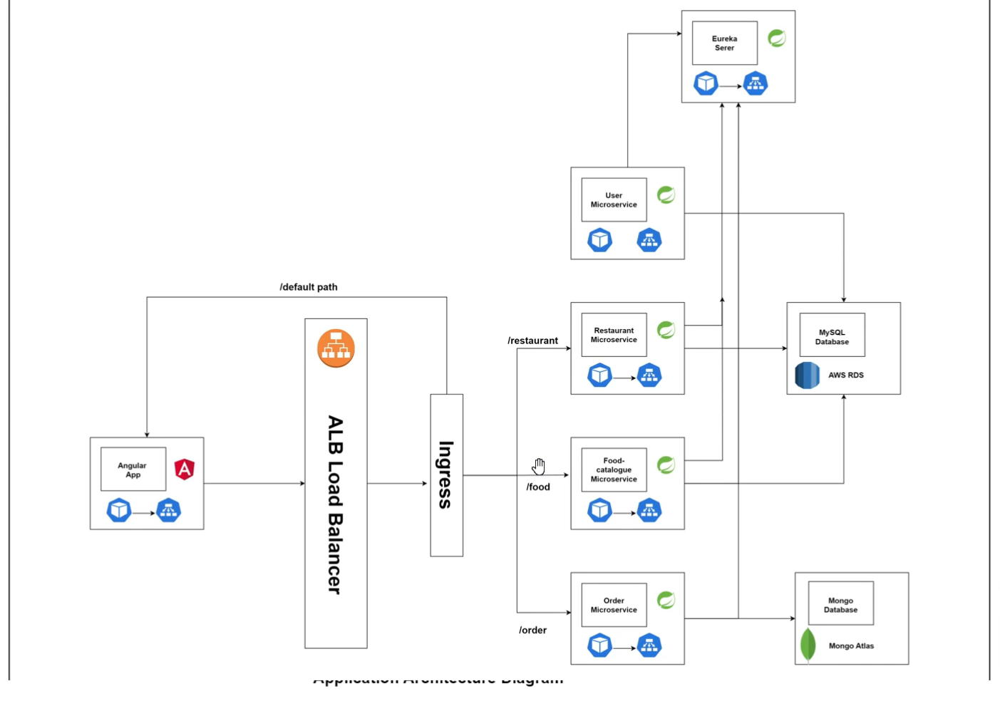

# Full Stack WebApplication

## Food Development App

### Architecture

### Deployment Structure

-------------------------------------------------------------------------------------------------

### Technologies Used

    - Rest/Restful
    - Spring boot
    - Microservices
    - Angular
    - Github
    - Junit
    - Sonar
    - Docker
    - Kubernetes 
    - AWS EKS ( Elastic Kubernetes Service)
    - AWS ALB (Load Balancer)
    - AWS EC2 (Elastic Compute Cloud)
    - AWS RDS(SQL)
    - Mongo Atlas (No-SQL)
    - Jenkins
    - ArgoCD

-------------------------------------------------------------------------------------------------

### Eureka server:

    Netflix developed the Eureka Service Discovery Server and Client. Eureka is a tool for service discovery and registration in microservices architectures.
    Microservices can register themselves with eureka server, providing inforamtion like (IP address, port , health status etc)

    - Discovery:
        clients can query eureka server to dynamically discover and locate services they need.

    - Fualt tolerance:
        eureka server continuously monitors the health

-------------------------------------------------------------------------------------------------

### Jar vs War

    `JAR (Java Archive):

    Executable JAR: Spring Boot applications are often packaged as executable JAR files. An executable JAR contains all the necessary dependencies, classes, and resources bundled into a single archive. It includes an embedded web server (like Tomcat or Jetty), allowing the application to be run as a standalone Java process.

    Easy Deployment: Deploying a Spring Boot application as a JAR file is straightforward. You can run it with a simple java -jar command, and the embedded web server starts the application.

    Self-contained: JAR files are self-contained and do not rely on an external servlet container. This makes them suitable for microservices and standalone applications.

    WAR (Web Application Archive):

    Traditional Web Application: A WAR file is a standard packaging format for web applications in Java. It is used for deploying applications to external servlet containers, such as Apache Tomcat, Jetty, or WildFly.

    Servlet Container Dependency: A WAR file assumes the presence of a servlet container to run the application. It contains servlets, JSP pages, HTML files, configuration files, and other resources specific to a web application.

    Legacy or Traditional Approach: In traditional enterprise environments where external servlet containers are common, WAR files are the preferred choice.`

Decision Criteria:

    Use an executable JAR if you want a self-contained, standalone application with an embedded web server.
    Use a WAR file if you need to deploy your Spring Boot application to an external servlet container or if your project is part of a larger enterprise system that follows the WAR deployment model.
    In many cases, Spring Boot developers prefer the JAR format because it simplifies deployment and eliminates the need for an external servlet container. However, the choice ultimately depends on your project requirements and deployment environment.

------------------------------------------------------------------------------------------

### MapStruct Dependency:

     A Java code generation library that simplifies the implementation of mappings between Java bean types. It is commonly used in Spring Boot applications to streamline the conversion of data between different data transfer objects (DTOs), entities, and other custom Java objects

     Note: This is used to conversion of DTO to entity and vice-versa and we should never allow users to access entity directly

     MapStruct ensures type safety during the mapping process. It performs compile-time checks, catching errors early in the development process rather than at runtime. This can help prevent issues related to mistyped field names or incorrect mappings.
